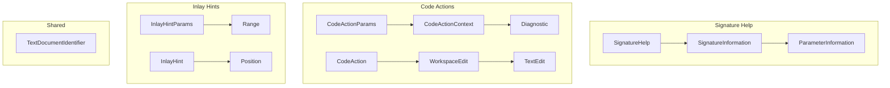

# Data Model: LSP Extended Features (Phase 9)

**Date**: 2025-12-14  
**Branch**: `001-lsp-extended`

## 新增 LSP 类型

以下类型需要添加到 `LspTypes.kt`：

---

### Signature Help

```kotlin
/**
 * Signature help represents the signature of something callable.
 */
data class SignatureHelp(
    /** One or more signatures. */
    val signatures: List<SignatureInformation>,
    /** The active signature. */
    val activeSignature: Int? = null,
    /** The active parameter of the active signature. */
    val activeParameter: Int? = null
)

/**
 * Represents the signature of something callable.
 */
data class SignatureInformation(
    /** The label of this signature. */
    val label: String,
    /** The human-readable doc-comment of this signature. */
    val documentation: String? = null,
    /** The parameters of this signature. */
    val parameters: List<ParameterInformation>? = null,
    /** The index of the active parameter. */
    val activeParameter: Int? = null
)

/**
 * Represents a parameter of a callable-signature.
 */
data class ParameterInformation(
    /** The label of this parameter. Can be string or [start, end] offsets. */
    val label: Any, // String | [Int, Int]
    /** The human-readable doc-comment of this parameter. */
    val documentation: String? = null
)

/**
 * Signature help options for server capabilities.
 */
data class SignatureHelpOptions(
    /** Characters that trigger signature help. */
    val triggerCharacters: List<String>? = null,
    /** Characters that re-trigger signature help. */
    val retriggerCharacters: List<String>? = null
)
```

---

### Workspace Symbols

```kotlin
/**
 * Parameters for workspace/symbol request.
 */
data class WorkspaceSymbolParams(
    /** A query string to filter symbols by. */
    val query: String,
    /** Work done token for progress reporting. */
    val workDoneToken: Any? = null
)

// SymbolInformation 已存在，用于 documentSymbol
```

---

### Formatting

```kotlin
/**
 * Parameters for textDocument/formatting request.
 */
data class DocumentFormattingParams(
    /** The document to format. */
    val textDocument: TextDocumentIdentifier,
    /** The format options. */
    val options: FormattingOptions
)

/**
 * Parameters for textDocument/rangeFormatting request.
 */
data class DocumentRangeFormattingParams(
    /** The document to format. */
    val textDocument: TextDocumentIdentifier,
    /** The range to format. */
    val range: Range,
    /** The format options. */
    val options: FormattingOptions
)

/**
 * Value-object describing what options formatting should use.
 */
data class FormattingOptions(
    /** Size of a tab in spaces. */
    val tabSize: Int,
    /** Prefer spaces over tabs. */
    val insertSpaces: Boolean,
    /** Trim trailing whitespace on a line. */
    val trimTrailingWhitespace: Boolean? = null,
    /** Insert a newline character at the end of the file if one does not exist. */
    val insertFinalNewline: Boolean? = null,
    /** Trim all newlines after the final newline at the end of the file. */
    val trimFinalNewlines: Boolean? = null
)
```

---

### Code Actions

```kotlin
/**
 * Parameters for textDocument/codeAction request.
 */
data class CodeActionParams(
    /** The document in which the command was invoked. */
    val textDocument: TextDocumentIdentifier,
    /** The range for which the command was invoked. */
    val range: Range,
    /** Context carrying information. */
    val context: CodeActionContext
)

/**
 * Context for code action request.
 */
data class CodeActionContext(
    /** Diagnostics known on the client side. */
    val diagnostics: List<Diagnostic>,
    /** Requested kind of actions to return. */
    val only: List<String>? = null,
    /** The reason why code actions were requested. */
    val triggerKind: Int? = null
)

/**
 * A code action represents a change that can be performed in code.
 */
data class CodeAction(
    /** A short, human-readable, title for this code action. */
    val title: String,
    /** The kind of the code action. */
    val kind: String? = null,
    /** The diagnostics that this code action resolves. */
    val diagnostics: List<Diagnostic>? = null,
    /** Marks this as a preferred action. */
    val isPreferred: Boolean? = null,
    /** The workspace edit this code action performs. */
    val edit: WorkspaceEdit? = null,
    /** A command this code action executes. */
    val command: Command? = null
)

/**
 * Code action kinds.
 */
object CodeActionKinds {
    const val QUICK_FIX = "quickfix"
    const val REFACTOR = "refactor"
    const val SOURCE = "source"
}

/**
 * Code action options for server capabilities.
 */
data class CodeActionOptions(
    /** CodeActionKinds that this server may return. */
    val codeActionKinds: List<String>? = null,
    /** Whether code action supports resolve. */
    val resolveProvider: Boolean? = null
)
```

---

### Inlay Hints

```kotlin
/**
 * Parameters for textDocument/inlayHint request.
 */
data class InlayHintParams(
    /** The document to query. */
    val textDocument: TextDocumentIdentifier,
    /** The visible range for which to compute inlay hints. */
    val range: Range
)

/**
 * Inlay hint information.
 */
data class InlayHint(
    /** The position of this hint. */
    val position: Position,
    /** The label of this hint. */
    val label: Any, // String | InlayHintLabelPart[]
    /** The kind of this hint. */
    val kind: Int? = null,
    /** Optional text edits applied when accepting this hint. */
    val textEdits: List<TextEdit>? = null,
    /** Render padding before the hint. */
    val paddingLeft: Boolean? = null,
    /** Render padding after the hint. */
    val paddingRight: Boolean? = null
)

/**
 * Inlay hint kinds.
 */
object InlayHintKinds {
    const val TYPE = 1
    const val PARAMETER = 2
}

/**
 * Inlay hint options for server capabilities.
 */
data class InlayHintOptions(
    /** Whether resolve is supported. */
    val resolveProvider: Boolean? = null
)
```

---

### WorkspaceEdit (补充)

```kotlin
/**
 * A workspace edit represents changes to many resources.
 */
data class WorkspaceEdit(
    /** Holds changes to existing resources. */
    val changes: Map<String, List<TextEdit>>? = null,
    /** Document changes supporting versioned changes. */
    val documentChanges: List<Any>? = null // TextDocumentEdit | CreateFile | RenameFile | DeleteFile
)

/**
 * A text document edit to a versioned document.
 */
data class TextDocumentEdit(
    /** The text document to change. */
    val textDocument: VersionedTextDocumentIdentifier,
    /** The edits to be applied. */
    val edits: List<TextEdit>
)

/**
 * Identifies a text document with version.
 */
data class VersionedTextDocumentIdentifier(
    /** The text document's URI. */
    val uri: String,
    /** The version number of this document. */
    val version: Int?
)

/**
 * A generic command.
 */
data class Command(
    /** Title of the command. */
    val title: String,
    /** The identifier of the actual command handler. */
    val command: String,
    /** Arguments that the command handler should be invoked with. */
    val arguments: List<Any>? = null
)
```

---

## 实体关系


